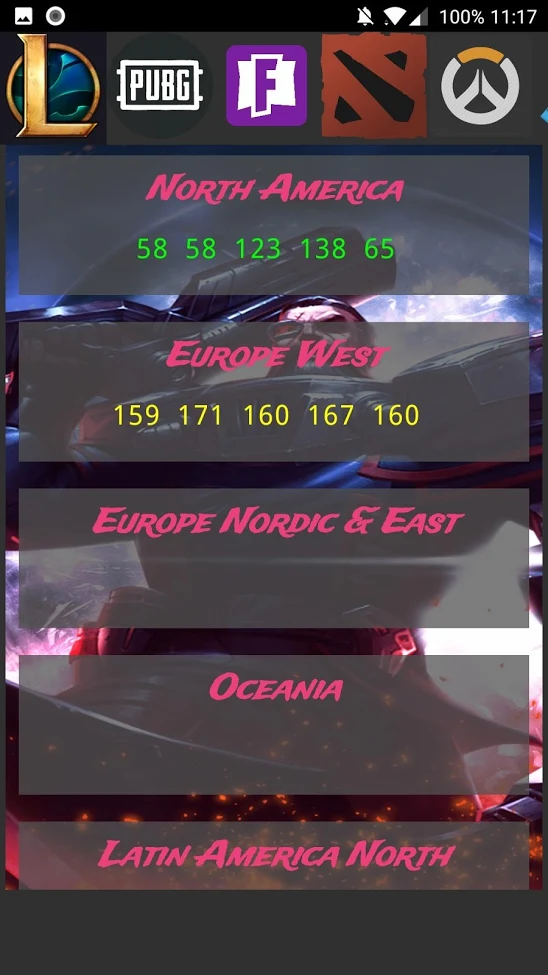
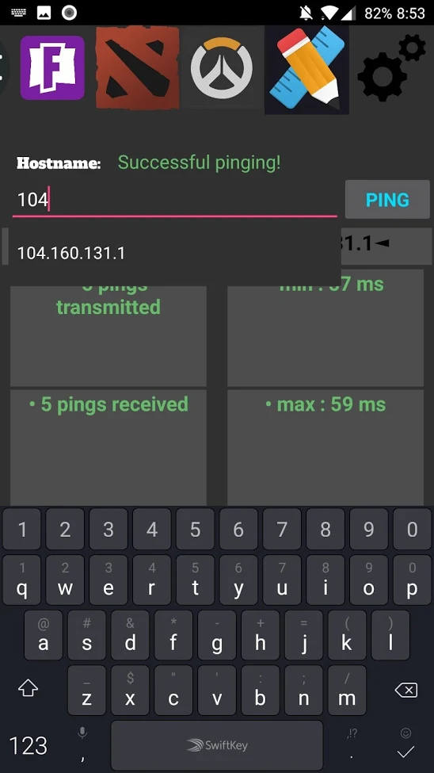
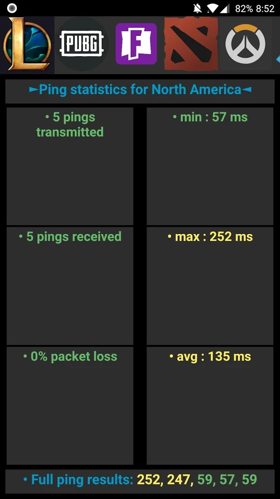

# Welcome to PING!

    

PING! is a network analyzer in the form of an Android application, developed and released to the public on the Google Play Store in the summer of 2018. Within its first month, PING! gained over 100+ active users and now contains over 600+ active users today.

I built PING! using **Android Studio** and **Java**. PING! is no longer being maintained as of 2019 but will forever remain one of the stepping stones of my programming career.

## Function
PING! was entirely built and designed from the ground up as a network analyzer, with specific tabs to analyze your connection to certain servers around the world that games used. PING! takes advantage of existing Android functionality and returns the results of "pings" sent from your phone to a destination server.

    
    
    

By scrolling through the navigation bar at the top of the application, you can view specific game servers around the world to analyze your connection to, or alternatively, check your connection to a server that you specify.

There is also a settings tab where you can configure the number of pings sent before results are displayed as well as adjusting the backgrounds of each tab.

## Development
I developed PING! using Android Studio as an IDE, and Java as the programming language (as was usual for Android applications). Android Studio uses Gradle, an advanced built toolkit, to automate and manage the build process for the Android application, which greatly streamlined product testing and development.

As I slowly gained more experience in building Android applications using Android Studio and Java, I had to refactor many portions of my code to make it more efficient for user accessibility as well as future scalability of the application.

## What did I take away?
Being one of my first major projects in programming - one that would be accessible to the public, PING! taught me a great amount about software development, mobile application development, and marketing to the public.

In addition, PING! further strengthened the importance of building a clean codebase from the get-go. Especially in an object-oriented language like Java, where using objects can greatly improve the readability and efficiency of your code.